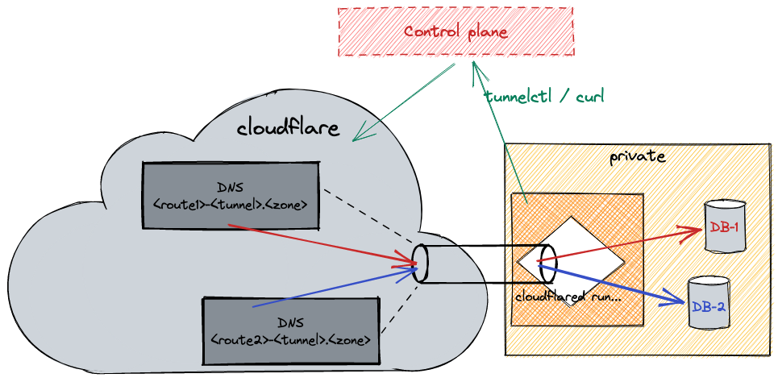

This repo contains a very quick and dirty POC showing how it is possible
to provide a control plane of cloudflare tunnels.

The control plane service is responsible to create cloudflare tunnels and
DNS records for the routes created y the users 

- [Configuring the server](#configuring-the-server)
- [As a user](#as-a-user)
  - [Setup](#setup)
  - [Create a tunnel](#create-a-tunnel)
  - [List tunnels](#list-tunnels)
  - [Get tunnel credentials](#get-tunnel-credentials)
  - [Create a route](#create-a-route)
  - [Get the tunnel configuration](#get-the-tunnel-configuration)
  - [Run the tunnel](#run-the-tunnel)
- [Access of a TCP endpoint](#access-of-a-tcp-endpoint)
- [Other consideration](#other-consideration)

# Configuring the server
* create a `secret` folder containing
  * create `secret/users.json` containing the list of user & passwords (yes, this is not secure. It's a POC)
  * cloudflare.yaml (see the example [config](secret.example/cloudflare.yaml))
  * the cloudflared certificate you obtain by running `cloudflared tunnel login`
  * the kubeconfig used to access and deploy on openshift (with a service account)
* setup your virtualenv
  * `python3 -m venv venv`
  * `source venv/bin/activate`
  * `python3 -m pip install -r requirements.txt`
* run the server
  * `start-server`

*Note*: only the server has real access to cloudflare API. The end-user can only run a tunnel. He cannot create a new one without going through our control-plane nor manage other cloudflare resources.

# As a user

## Setup
A `tunnelctl` script is provided to avoid running `curl` commands all the time.
Let's set it up to target our local cluster:

```sh
# our server is running locally
export CONTROL_PLANE=localhost:5000
# here, our user is user1, with password user1password
export USERPASS=user1:user1password
```

## Create a tunnel
To request the creation of a tunnel:
```sh
./tunnelctl create
```
The server will then run `cloudflare create ...`

The output will show the random name generated for our tunnel.
We'll refer to this name as TUNNEL.

## List tunnels
To list the created tunnels for your user, as well as the configured routes
```sh
./tunnelctl list
```

## Get tunnel credentials
To run a tunnel, the user will need a JSON credentials file.
We're getting it for our new tunnel with
```sh
# Replace TUNNEL with your tunnel name obtained previously
./tunnelctl credentials TUNNEL > credentials.json
```

## Create a route
A route allows to register an endpoint that will route traffic towards your local "Service".
Services are represented by URL of the form `http://<host>:<port>` or `tcp://<host>:<port>`.

Let's create 2 routes within our tunnel: one to access an http service and an other for a tcp service.
```sh
# Replace TUNNEL with your tunnel name obtained previously

# a http service running locally on our machine, and listening on port 8000
./tunnelctl create TUNNEL http://localhost:8000

# a tcp service running on 192.168.1.10, and listening on port 10000
./tunnelctl create TUNNEL tcp://192.168.1.10:10000
```

When running that, the control-plane will generate new random names for those routes and create corresponding DNS records. It will also deploy tunnel-access pods, but let's discuss that later.

## Get the tunnel configuration
We already have a credentials file for our tunnel. We also need a configuration,
containing all the routes we described:
```sh
# Replace TUNNEL with your tunnel name obtained previously
./tunnelctl config TUNNEL > config.yaml
```

## Run the tunnel
That's it! We can now run the tunnel with cloudflared ([downloads](https://developers.cloudflare.com/cloudflare-one/connections/connect-apps/install-and-setup/installation))

```sh
cloudflared tunnel --config config.yaml run --cred-file credentials.json
```

Other parties can now access your http endpoint (routed above) with the automatically generated DNS name. We can even use https automagically thanks to cloudflare dynamic certificate.

It's a bit trickier for the tcp endpoint because something needs to run on the client side.

*Note*: The configuration must be regenerated and the tunnel restarted for each new route being created 



# Access of a TCP endpoint
We're not on the user machine anymore. We're now considering what happens on the
cloud service which needs to access the endpoints created by the user.

As we saw previously, the http endpoint can be reached, but something needs to be executed for the client side: `cloudflared access`. See https://developers.cloudflare.com/cloudflare-one/applications/non-http/arbitrary-tcp#connect-from-a-client-machine for the official doc.

Here, we presume our cloud based service, which needs to access the end-user TCp
endpoint, runs on Openshift. For each new 'route' to a tcp endpoint, the control-plane will deploy a set of pod and service to run `cloudflared access` with the correct parameters.

The manifests can be seen in [deployment.yaml](deployment.yaml).

With this in place, the cloud-based service can reach out to the newly created kubernetes service named `tunnel-access-${ROUTE_NAME}-${TUNNEL_NAME}`, on port 10000 (exposed by the access pod and the service, hardcoded in [deployment.yaml](deployment.yaml)). The traffic will be routed towards the tunnel endpoint, through it, and down to the end-user private tcp service endpoint for that route

# Other consideration
It would also be possible to restrict access to the tunnel entrypoints if we knew what were the sources of traffic. This would be done by configuring cloudflare firewall rules during `tunnelctl create TUNNEL SERVICE` calls (on the control plane side of course).
